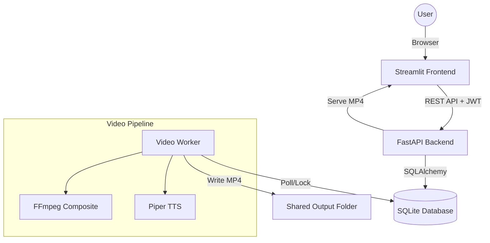
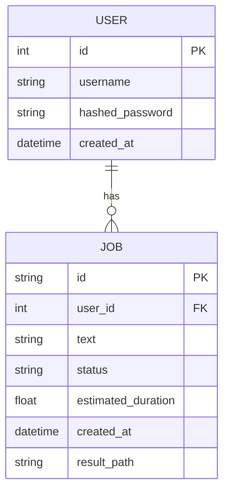

# BrainrotGen

Short-form "Brainrot" video generator: **FastAPI** backend (`backend/`), **Streamlit** frontend (`frontend/`), and a video **worker** (`worker/`). Shared SQLite database (`data/app.db`) and output directory (`output/`) for generated videos.

## Quick Start

Before the first run:

1. Create `data/` and `output/` (or let Compose use the repo’s `./data` and `./output` mounts — they are created on first backend start if missing).
2. Add **at least one** `.mp4` gameplay clip under `worker/assets/minecraft/` (and optionally `worker/assets/subway/` for that background).

```bash
docker compose up --build
```

| Service  | URL                        |
|----------|----------------------------|
| Frontend | http://localhost:8501       |
| Backend  | http://localhost:8000       |
| API docs | http://localhost:8000/docs  |

### End-to-end scenarios (MVP)

**Prerequisites**

- `data/` and `output/` exist (Compose can create them on first backend start).
- At least one `.mp4` under `worker/assets/minecraft/` (and `worker/assets/subway/` if you choose that background).
- From the repo root: `docker compose up --build`, then open the frontend URL.

**Happy path — register → generate → done → download**

1. Open the frontend, **Register** a new user (or **Login** if the account exists).
2. On the generate screen, enter text, pick **Voice** and **Background**, click **Generate Video**.
3. Wait on the preview page until **Status** is `done` (the page auto-refreshes while queued/processing).
4. Confirm the video plays inline, then use **Download MP4** (or fetch the file via the API using the same auth token).

**Quota exhausted**

1. Use an account that has already consumed the daily allowance (5 minutes per user, UTC day; see backend `DAILY_QUOTA_SECONDS` / default 300s), or submit jobs until the API returns quota errors.
2. Creating another job should show **429** / `QUOTA_EXCEEDED` from the API; the Streamlit UI shows a quota error and blocks generation when **Remaining** is `0:00`.

**Local quality checks (optional)**

- Install hooks: `pip install pre-commit && pre-commit install`
- Same checks as CI (without pytest): `python scripts/run_pre_commit_checks.py`
- Include tests: `python scripts/run_pre_commit_checks.py --with-pytest`

To run **multiple workers** against the same DB and `output/` (architecture demo):  
`docker compose up --build --scale worker=2`

### End-to-end: shared database and volumes

Backend and worker must use the **same SQLite file** on disk:

| Host path | In backend container | In worker container |
|-----------|----------------------|---------------------|
| `./data`  | `data/app.db` (`SQLITE_FILE`) | `/app/data/app.db` (`SQLITE_PATH`) |

Generated videos go to **`./output`** (`MEDIA_ROOT` / `OUTPUT_DIR`). The worker writes completed jobs here; the API serves files from the same tree.

## Architecture

### System Flow


### Database Schema (ERD)


## Load Testing

Run the performance suite to verify P95 latency:
```bash
./scripts/run_load_tests.sh http://localhost:8000
```
- **Scenarios**: Registration, Login, Quota, Job management.
- **Goal**: P95 < 200ms.
- **Reporting**: Detailed HTML reports are saved to `reports/load/`.

## Documentation

- **System Quality & Metrics**: [QUALITY_REPORT.md](QUALITY_REPORT.md)
- **API Reference**: [API.md](API.md)
- **Frontend Guide**: [frontend/README.md](frontend/README.md)
- **Backend Guide**: [backend/README.md](backend/README.md)
- **Worker/Pipeline Details**: [README-WORKER.md](README-WORKER.md)

---

## Quality Status

| Category        | Standard / Limit       | Current Status |
|-----------------|------------------------|----------------|
| **Maintainability** | Radon MI >= 65         | ✅ Passed      |
| **Reliability**     | Coverage >= 60%        | ✅ Passed      |
| **Performance**     | P95 Latency < 200ms    | ✅ Passed*     |
| **Security**        | Bandit (High/Med = 0)  | ✅ Passed      |

*\*P95 goal maintained for all metadata endpoints. See [Quality Report](QUALITY_REPORT.md) for details.*
